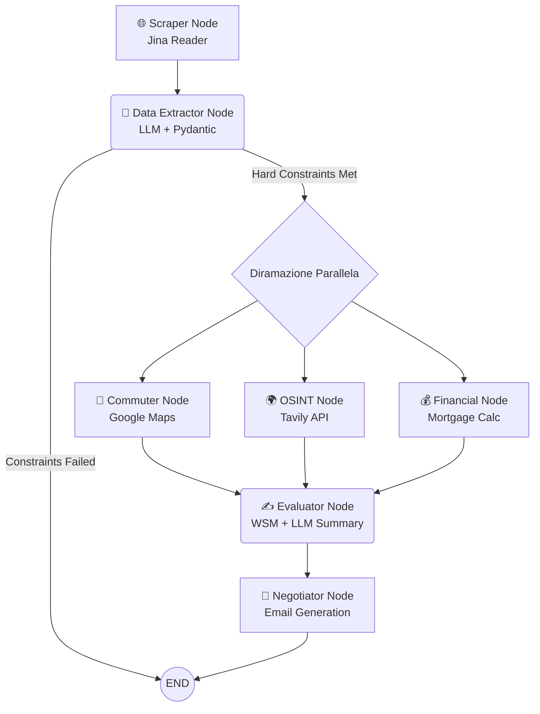

# 🏢 AI Property Finder


## 🚀 L'Analista Immobiliare AI Personale

**Home Finder** è un sistema multi-agente avanzato che trasforma un semplice link di un annuncio immobiliare in una completa *due-diligence*. Attraverso un'architettura a grafo, l'intelligenza artificiale estrae i dati, valuta la logistica, analizza il contesto del quartiere tramite OSINT, simula il piano finanziario e stila un'email di negoziazione strategica basata sui difetti reali dell'immobile. Tutto in pochi secondi.

---

## ✨ Killer Features

*   🕸️ **Web Scraping Resiliente:** Supera i blocchi anti-bot utilizzando Jina Reader per estrarre il testo grezzo dagli annunci. Include un sistema di *fallback* UI per l'inserimento manuale del testo.
*   🔀 **Map-Reduce Architecture:** Sfrutta la potenza di LangGraph per l'esecuzione parallela. Dopo l'estrazione iniziale, gli agenti di logistica, OSINT e finanza lavorano in contemporanea per ridurre drasticamente i tempi di attesa.
*   🌍 **OSINT & Logistica:** Non solo metri quadri. L'agente logistico calcola i tempi di pendolarismo reali verso il tuo ufficio tramite Google Maps, mentre l'agente OSINT indaga su criminalità e copertura fibra (FTTH) del quartiere usando Tavily.
*   💰 **Financial Advisor:** Analizza il prezzo richiesto, calcola il mutuo stimato in base al tuo anticipo e ai tassi attuali, e definisce un "Target Price" agevolato (sconto del 12%).
*   🤝 **Agente Negoziatore:** Crea automaticamente un'email di negoziazione formale ma decisa, sfruttando le vulnerabilità trovate (es. assenza di ascensore, zona poco sicura) per giustificare un'offerta al ribasso.

---

## 🧠 Architettura del Grafo (Multi-Agent Workflow)

Il flusso di lavoro è orchestrato tramite **LangGraph**, garantendo un'esecuzione controllata, con *conditional routing* e rami paralleli.



---

## 🛠️ Tech Stack

Il progetto si basa sulle migliori tecnologie moderne per l'AI e lo sviluppo web:

*   **Orchestrazione:** [LangGraph](https://python.langchain.com/docs/langgraph) / LangChain
*   **LLM Engine:** [Google Gemini](https://ai.google.dev/) (modelli `gemini-flash-lite-latest` per l'estrazione veloce e `gemini-flash-latest` per il reasoning complesso)
*   **Web UI:** [Streamlit](https://streamlit.io/)
*   **Data Validation:** [Pydantic](https://docs.pydantic.dev/)
*   **External APIs:**
    *   [Tavily](https://tavily.com/) (Motore di ricerca AI per OSINT)
    *   [Google Maps Distance Matrix](https://developers.google.com/maps/documentation/distance-matrix) (Logistica e tempi di percorrenza)
    *   [Jina Reader](https://jina.ai/) (Estrazione testo da URL)

---

## ⚙️ Setup e Installazione

Segui questi passaggi per configurare l'ambiente locale e far partire l'applicazione.

**1. Clona la repository**
```bash
git clone https://github.com/tuo-username/home-finder.git
cd home-finder
```

**2. Crea e attiva l'ambiente virtuale**
```bash
python -m venv venv
# Su Windows:
venv\Scripts\activate
# Su macOS/Linux:
source venv/bin/activate
```

**3. Installa le dipendenze**
```bash
pip install -r requirements.txt
```
*(Assicurati che nel file `requirements.txt` siano inclusi pacchetti chiave come `streamlit`, `langgraph`, `langchain-google-genai`, `pydantic`, `requests`, `python-dotenv`).*

**4. Configura le Variabili d'Ambiente**
Crea un file `.env` nella root del progetto e inserisci le tue chiavi API:
```env
# Google Gemini API Key
GOOGLE_API_KEY=your_gemini_api_key_here

# Tavily API Key per l'agente OSINT
TAVILY_API_KEY=your_tavily_api_key_here

# Google Maps API Key per l'agente Commuter
GOOGLE_MAPS_API_KEY=your_google_maps_api_key_here
```

---

## 🎮 Utilizzo

Una volta configurato l'ambiente, lanciare l'interfaccia utente è semplicissimo.
Dal tuo terminale, esegui:

```bash
streamlit run app.py
```

Si aprirà automaticamente una finestra nel tuo browser predefinito.
1. Inserisci l'URL dell'annuncio (o usa l'espansore per incollare il testo manualmente se il sito ha protezioni anti-scraping).
2. Imposta l'indirizzo del tuo ufficio, il budget massimo e i parametri finanziari (anticipo, tasso, durata).
3. Clicca su **"Avvia Analisi Completa"** e osserva gli agenti lavorare in tempo reale!
