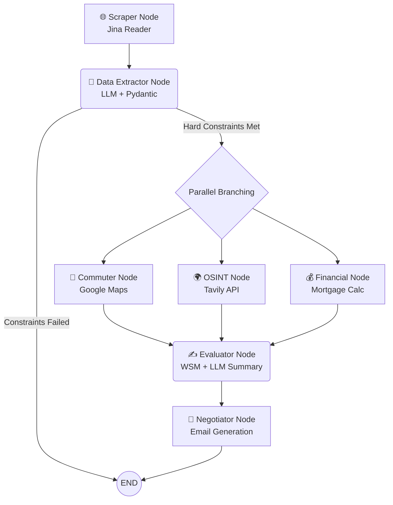

# 🏢 Home Finder


## 🚀 Your Personal AI Real Estate Analyst

**Home Finder** is an advanced multi-agent system that transforms a simple property listing link into a comprehensive *due-diligence*. Through a graph architecture, artificial intelligence extracts data, evaluates logistics, analyzes the neighborhood context via OSINT, simulates the financial plan, and drafts a strategic negotiation email based on the property's actual flaws. All in just a few seconds.

---

## 📸 Demo & Preview

> [!IMPORTANT]
> **Demo GIF and Screenshots coming soon!**

| Analysis Workflow | Financial Dashboard |
| :---: | :---: |
|  |  |

---

## ✨ Features

*   🕸️ **Resilient Web Scraping:** Bypasses anti-bot blocks using Jina Reader to extract raw text from listings. Includes a UI *fallback* system for manual text entry.
*   🔀 **Map-Reduce Architecture:** Leverages the power of LangGraph for parallel execution. After the initial extraction, logistics, OSINT, and finance agents work concurrently to drastically reduce wait times.
*   🌍 **OSINT & Logistics:** Not just square meters. The logistics agent calculates real commuting times to your office via Google Maps, while the OSINT agent investigates neighborhood crime rates and fiber coverage (FTTH) using Tavily.
*   💰 **Financial Advisor:** Analyzes the asking price, calculates the estimated mortgage based on your down payment and current rates, and defines a discounted "Target Price" (12% discount).
*   🤝 **Negotiator Agent:** Automatically creates a formal yet firm negotiation email, leveraging found vulnerabilities (e.g., lack of elevator, unsafe area) to justify a lower offer.

---

## 🧠 Graph Architecture (Multi-Agent Workflow)

The workflow is orchestrated via **LangGraph**, ensuring controlled execution with *conditional routing* and parallel branches.



---

## 🛠️ Tech Stack

The project is built on the best modern technologies for AI and web development:

*   **Orchestration:** [LangGraph](https://python.langchain.com/docs/langgraph) / LangChain
*   **LLM Engine:** [Google Gemini](https://ai.google.dev/) (`gemini-flash-lite-latest` models for fast extraction and `gemini-flash-latest` for complex reasoning)
*   **Web UI:** [Streamlit](https://streamlit.io/)
*   **Data Validation:** [Pydantic](https://docs.pydantic.dev/)
*   **External APIs:**
    *   [Tavily](https://tavily.com/) (AI Search Engine for OSINT)
    *   [Google Maps Distance Matrix](https://developers.google.com/maps/documentation/distance-matrix) (Logistics and travel times)
    *   [Jina Reader](https://jina.ai/) (Text extraction from URL)

---

## ⚙️ Setup and Installation

### 🐳 Option A: Docker (Recommended)
The fastest way to get Home Finder running is using Docker.

1. **Clone and Navigate**
   ```bash
   git clone https://github.com/attilio-ap/HomeFinder.git
   cd HomeFinder
   ```
2. **Configure Environment**
   Create a `.env` file and add your API keys.
3. **Run with Docker Compose**
   ```bash
   docker-compose up --build
   ```
   The app will be available at `http://localhost:8501`.

### 🐍 Option B: Local Python Environment
Follow these steps to configure your local environment manually.

**1. Clone the repository**
```bash
git clone https://github.com/attilio-ap/HomeFinder.git
cd HomeFinder
```

**2. Create and activate a virtual environment**
```bash
python -m venv venv
# On Windows:
venv\Scripts\activate
# On macOS/Linux:
source venv/bin/activate
```

**3. Install dependencies**
```bash
pip install -r requirements.txt
```

**4. Configure Environment Variables**
Create a `.env` file in the project root and insert your API keys:
```env
# Google Gemini API Key
GOOGLE_API_KEY=your_gemini_api_key_here

# Tavily API Key for the OSINT agent
TAVILY_API_KEY=your_tavily_api_key_here

# Google Maps API Key for the Commuter agent
GOOGLE_MAPS_API_KEY=your_google_maps_api_key_here
```

---

## 🎮 Usage

Once the environment is configured, launching the user interface is simple.
From your terminal, run:

```bash
streamlit run app.py
```

A window will automatically open in your default browser.
1. Enter the listing URL (or use the expander to manually paste text if the site has anti-scraping protections).
2. Set your office address, maximum budget, and financial parameters (down payment, rate, term).
3. Click on **"Start Full Analysis"** and watch the agents work in real-time!
